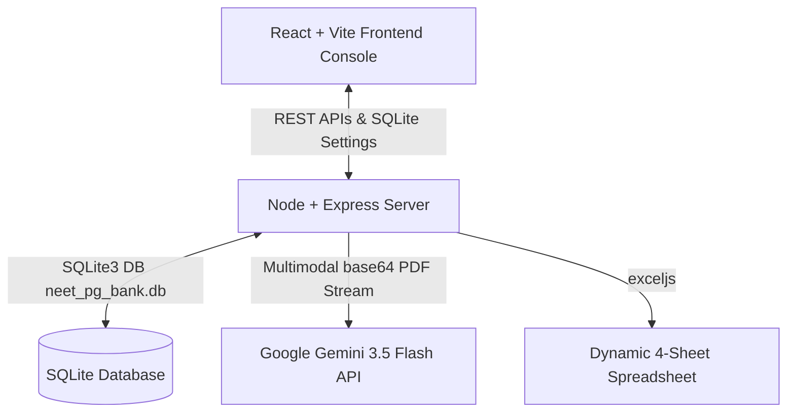

# NEET PG Previous Year Question Ingestion & Processing System

A premium, state-of-the-art medical question ingestion and processing system. The console enables users to upload NEET PG Previous Year Question papers (PDF format, standard digital or scanned image-based), dynamically parse and clean visual watermark logos, enrich MCQs via **Google Gemini 3.5 Flash Multimodal AI**, zoom medical diagrams inside a glassmorphic dashboard, and compile highly standardized, zero-skewed, centered spreadsheet databases.

---

## 🚀 Key Features

* **AI Multimodal PDF Ingestion**: Natively processes scanned, image-based, or non-standard PDF question papers by encoding the documents into base64 streams and calling Google Gemini 3.5 Flash to automatically extract clinical text, MCQs, options, and correct answers.
* **Scanned Watermark/Logo Filters**: Employs a self-learning image frequency scanner that dynamically flags and excludes repeated header/footer watermarks (such as corporate logo banners) while preserving unique question diagrams page-by-page.
* **Clinical MCQ AI Enrichment**: Queries Gemini 3.5 Flash to generate clinical rationales explaining why the correct answer is chosen, categorize questions by clinical subject, chapter, and topic, calculate difficulty levels, and extract relevant medical keywords.
* **Clickable Diagram Viewport Zoom**: Displays medical diagrams inside a sleek dashboard modal with a floating zoom trigger, launching a gorgeous full-screen backdrop overlay (`backdrop-filter: blur(12px)`) with scale zoom transitions.
* **Secure API Key Management Vault**: An embedded Settings panel that securely persists the Gemini API Key in an SQLite `SystemSettings` table, displaying it masked (`****`) with updating controls.
* **Proportional Excel Compiler**: Streams a clean 4-sheet dynamic Excel workbook (`QuestionBank`, `QuestionImages`, `OCRIssues`, `Summary`). Questions diagrams are embedded centered, padded, and proportion-scaled to exactly 5 cm inside Column Q with native EMU boundaries to avoid warping in Microsoft Excel.
* **Ingestion Diagnostics Tracker**: Tracks the source state of each question (e.g. `'Gemini AI'` vs `'Local Fallback'`) in both the database and the exported spreadsheets.

---

## 🛠️ Architecture & Tech Stack



### Backend (Core Server)
* **Runtime**: Node.js, Express.js
* **Database**: SQLite3 (native node driver)
* **PDF Engine**: `pdf-parse` (with named exports support)
* **Spreadsheet Engine**: `exceljs`
* **File Uploads**: `multer`

### Frontend (Client Console)
* **Runtime**: React.js, Vite
* **Styling**: Sleek Vanilla CSS with modern glassmorphism panels, harmonious tailored HSL color palettes, and responsive grid layouts.

---

## 📦 Getting Started

### Prerequisites
* **Node.js**: v18.0.0 or higher
* **npm**: v9.0.0 or higher
* **Google Gemini API Key**: (Can be set securely directly in the UI settings console)

### Installation & Run

1. **Clone the Repository**:
   ```bash
   git clone https://github.com/sanjeevreddyk/neetpg-analyzer.git
   cd neetpg-analyzer
   ```

2. **Install Dependencies**:
   * **Root (Backend)**:
     ```bash
     npm install
     ```
   * **Client (Frontend)**:
     ```bash
     cd client
     npm install
     cd ..
     ```

3. **Start the Applications**:
   * **Run Express Server**:
     ```bash
     npm run dev
     ```
     The server will spin up on `http://localhost:5000`.
   * **Run React Client Console**:
     ```bash
     cd client
     npm run dev
     ```
     Vite will host the dashboard console on `http://localhost:3000` (or `http://localhost:3001`).

---

## ⚙️ How to Use

1. **Setup Gemini API Key**:
   * Open the React Console in your browser.
   * Click the **⚙️ Settings** icon on the top right next to the System Console tab.
   * Enter your Google Gemini API key and click **Submit**. The key is securely stored in your local database.
2. **Upload Question Papers**:
   * Go to the **Visual Upload** panel.
   * Select a standard or scanned NEET PG PDF question paper and click **Upload**.
3. **Monitor Logs**:
   * Open the **System Console** tab to view real-time log streams of the background ingestion, AI multimodal calls, diagram unlinking, and dynamic watermark checks.
4. **View Question Repository**:
   * Go to the **Question Bank** tab.
   * Toggle layouts between Spacious Card View and Compact Table.
   * Filter questions dynamically by Subject or Year, or click on a diagram to open the full-screen zoom overlay.
5. **Download Database Sheets**:
   * Click **Download Excel** inside the repository.
   * The spreadsheet includes 4 sheets showing centered diagrams, classifications, rationales, and generation sources (`'Gemini AI'` or `'Local Fallback'`).

---

## 🗄️ Database Schemas

### 1. `QuestionBank`
Stores detailed records of each ingested MCQ.
* `Question_ID` (TEXT, Primary Key)
* `Upload_ID` (TEXT, Foreign Key)
* `Question_Number` (INTEGER)
* `Question_Text` (TEXT)
* `Option_A`, `Option_B`, `Option_C`, `Option_D` (TEXT)
* `Correct_Answer` (TEXT)
* `Answer_Explanation` (TEXT)
* `Subject`, `Chapter`, `Topic` (TEXT)
* `Difficulty_Level` (TEXT)
* `Image_Present` (INTEGER)
* `Embedded_Image` (TEXT)
* `Generation_Source` (TEXT, `'Gemini AI'` or `'Local Fallback'`)

### 2. `SystemSettings`
Secure system key-value vault.
* `Setting_Key` (TEXT, Primary Key)
* `Setting_Value` (TEXT)

---

## 📡 REST API Reference

| Endpoint | Method | Description |
|---|---|---|
| `/api/upload` | `POST` | Uploads PDF question papers and registers metadata in ledger. |
| `/api/process` | `POST` | Triggers async background PDF parsing, OCR cleaning, image unlinking, and AI multimodal parsing. |
| `/api/summary` | `GET` | Compiles real-time aggregated stats for the dashboard graphs. |
| `/api/downloadExcel` | `GET` | Generates and streams the centered-diagram 4-sheet spreadsheet. |
| `/api/settings/gemini_api_key` | `GET` | Fetches whether the Gemini key is configured and returns it masked (`****`). |
| `/api/settings/gemini_api_key` | `POST` | Updates or saves the key securely in SQLite. |

---

## 📄 License

This project is licensed under the MIT License. Created with 💖 by Antigravity.
